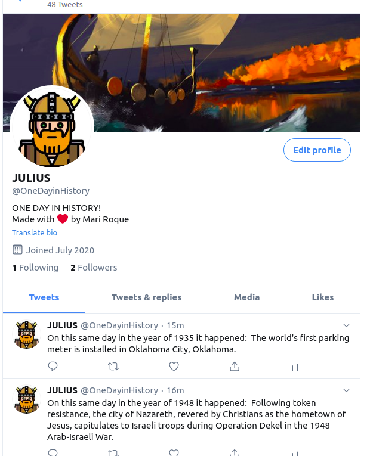

# One_day_in_history (Twitter Bot)

This is a twitter bot developed to share interesting historical facts that happened on the current day, but years ago.

​It is currently implemented on the Julius Account on Twitter: [ Click here to Check](https://twitter.com/OneDayinHistory)

Julius is a Viking Bot who shares historical facts about the current day every 2 hours.

### [Watch the Video for more information.](https://www.loom.com/share/05acf4659e06465f89fb9abde0714e77)

​
## Instructions to Implement your own historical Bot
​
To have a version on your local machine:
- Create a developer account on Twitter and add a new project. You can do it on the [ Developer Twitter Page](https://developer.twitter.com/en)
- Twitter will provide 4 different keys for your project. Grab it and keep it safe.
- Clone this repository on your local machine, rename the template.env. Its name should be just ".env"
- Replace the content of the .env using the keys provided by Twitter.
- Exclusively for TSE review - You can find my private keys on that doc : [ Here](https://docs.google.com/document/d/17pg_2MWIBoOdBNdfe-NymuDKNujNBjGKR15mAMw7_sU/edit?usp=sharing)
- Install the necessary gems listed on the Gemfile 

> gem install <gem_name>

- Execute bin/main.rb on the project folder within your terminal

## Running Tests

     This branch contains a folder named "spec" with files to test the public methods of the classes. To run it you can follow the steps bellow

     - Run the following command on your local machine:

        > gem install rspec

      - After successfully install the Gem you can access the spec folder and run the following command to check the results.

        > rspec spec/bot_test.rb
      To test the board class methods.

        > rspec spec/json_data_test.rb
      To test the json_data class methods.

        > rspec spec/tweet_test.rb
      To test the tweet class methods.

## Author

👤 **Marilena Roque**

- Github: [MarilenaRoque](https://github.com/MarilenaRoque)
- Twitter: [@MariRoq88285995](https://twitter.com/MariRoq88285995)
- Linkedin: [roquemarilena](https://www.linkedin.com/in/roquemarilena/)

## 🤝 Contributing

    Contributions, issues and feature requests are welcome!

Feel free to check the [issues page](https://github.com/MarilenaRoque/one_day_in_history/issues).

## Show your support

Give a ⭐️ if you like this project!

## 📝 License
This project is [MIT](lic.url) licensed.